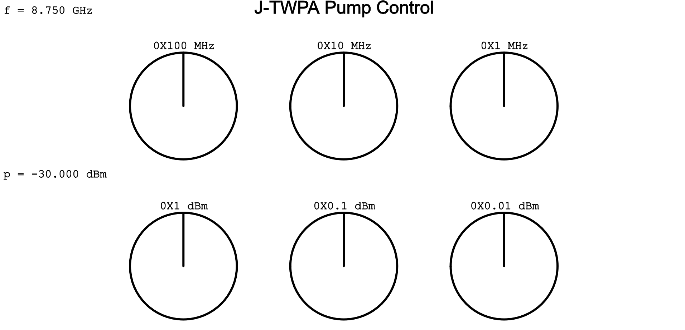

# [TWPA](https://github.com/lafefspietz/jpa-twpa-qubit-noise-summer-2026/tree/main/twpa)

This is a JPA at the input of a TWPA, measuring with no flux bias or pump on JPA, just to look at TWPA with a reflective load at input.  The various DC/audio sources are all off. Channel A on the WindFreak is off, and channel B is the TWPA pump.  Room temperature switches must be in one of two states to measure the system and look at the signal from this channel, and the programmable attenuator should be set to 25 dB or so, with power on VNA about -30 dBm.

1. Download [twpa-code.zip](twpa-code.zip), extract it, and copy all the files in there into whatever folder you plan to save your data in.
2. Open [setup.ipynb](setup.ipynb) and set the [RCDAT-44G-63 Programmable Attenuator](https://www.minicircuits.com/WebStore/dashboard.html?model=RCDAT-44G-63) and [RC-4SPDT-A18 Switches](https://www.minicircuits.com/WebStore/dashboard.html?model=RC-4SPDT-A18) as specified in the notebook.
3. Open a Miniforge or Anaconda prompt or shell prompt in Linux, navigate to the folder where the the files are, and run `python pump.py`
4. Open pump.html and control the pump using the web GUI, controlling the power and frequency of the pump with the mouse wheel while hovering the mouse over whatever knob you want to turn
5. Take vna traces with [vna-trace.ipynb](vna-trace.ipynb)
6. Take spa traces with [spa-trace.ipynb](spa-trace.ipynb)

 - [twpa-code.zip](twpa-code.zip)
 - [setup.ipynb](setup.ipynb)
 - [pump.html](pump.html)
 - [pump.py](pump.py)
 - [vna-trace.ipynb](vna-trace.pynb)
 - [spa-trace.ipynb](spa-trace.ipynb)
 - [pump.ipynb(manually set power)](pump.ipynb)

## Web GUI Screenshot:

